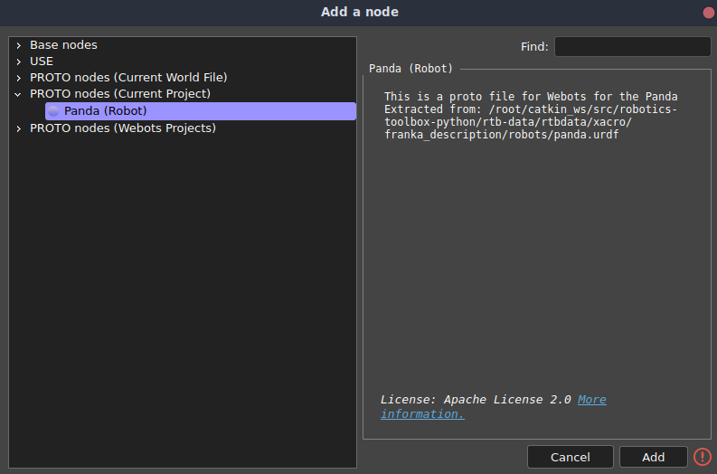
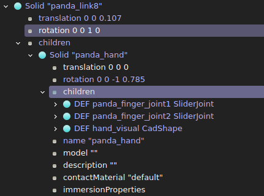

# How to automate the movement of the Panda in Webots
This repository has been built with the goal of providing users with a step-by-step process to automate the movement of the Franka-Emika Panda's robotic arm in [Webots](https://cyberbotics.com/#webots). This is particularly important for projects that place the end-effector of the arm in random, or not known in advance, locations. In such cases, in fact, the joints' angles cannot be computed beforehand, thus requiring a different approach to be adopted.

This guide will make use of the [Robotics Toolbox for Python](https://github.com/petercorke/robotics-toolbox-python) library, which provides tools for managing kinematic operations for a set of robotic arms. Between the supported models, there is also the [Franka-Emika Panda](https://petercorke.github.io/robotics-toolbox-python/arm_dh.html#roboticstoolbox.models.DH.Panda), which was based on the URDF file contained inside [franka_ros](https://frankaemika.github.io/docs/control_parameters.html) package. The base idea is to provide the library with the joints' current position and the movement's information and, then, to harness its ability to solve the inverse kinematic equations for the Panda manipulator to obtain the final angles, which will be used inside the simulated environment.

Unfortunately, as of Webots version R2023b, the arm model contained inside the Python library differs from the one included inside Webots. The two of them, in fact, present different rotating axes for some of the joints, making it difficult to adopt the computed results without further elaborations. To remedy this issue, the model used by the library can be compiled from scratch and imported as a new Robot entity to be controlled in Webots. You can either follow the procedure reported in the [following section](#creating-the-panda-proto-file)  to generate the new entity or include the [provided PROTO file](./panda-webots/protos/Panda.proto) contained in this repository inside your simulated world. 

After having imported and instantiated the Robot entity inside the virtual environment, you can follow the steps reported [in the final section](#programming-the-panda-controller) to implement the robotics library for the arm's movement inside the controller.

>[!NOTE]
>In case you aren't interested in replicating the steps yourself, you can download the Webots world contained inside this repository and customize it to your liking.

## Creating the Panda PROTO file
>[!IMPORTANT]
>The steps reported in this section are based on [this tutorial guide](https://github.com/cyberbotics/urdf2webots/blob/master/docs/tutorial.md) from Cyberbotics Ltd.. If you encounter any problem during their execution, it is advised to check the original documentation, as it may be updated with new information.

To convert the description of the Panda into a PROTO node, two tools are necessary: [ROS](https://www.ros.org/) and the [urdf2webots](https://github.com/cyberbotics/urdf2webots) Python library. In case you don't need ROS in your system or you can't install it on your machine due to support issues, you can pull its docker image, available at [this link](https://hub.docker.com/r/osrf/ros/tags). Make sure the ROS installation comprises the xacro tool, since it may not be included by default. If that is the case, you can install it, on Ubuntu, by using the following command (substitute your ROS distribution for "noetic"):
```
sudo apt install ros-noetic-xacro
```

After having installed both tools, recover the files used to describe the Panda robot by cloning the repository of the library:
```
git clone https://github.com/petercorke/robotics-toolbox-python.git
cd robotics-toolbox-python
```
The needed files can be found in `rtb-data/rtbdata/xacro/franka_description/`. Here, two folders are present: "meshes" contains the `.dae` files used by Webots to graphically render the joints of the robot, whereas the "robots" folder holds the `.xacro` file which describes how the joints are connected to form the arm. Between all the descriptions, for our case, only the `panda_arm_hand.urdf.xacro`, `panda_arm.xacro` and `hand.xacro` are required. To compile the xacros of the arm into an URDF description, use the reported command:
```
rosrun xacro xacro -o panda.urdf panda_arm_hand.urdf.xacro
```

>[!IMPORTANT]
>In the event that the `panda_arm` and `hand` xacro files cannot be found by the compiler, substitute in the `panda_arm_hand.urdf.xacro` file the paths already present with their absolute or relative counterpart.

Finally, to convert the produced URDF into a PROTO description, launch the importer module from the urdf2webots library through the terminal:
```
python3 -m urdf2webots.importer --input=panda.urdf --box-collision --tool-slot=panda_link8
```
The `--box-collision` option indicates to the converter that the bounding objects have to be approximated using boxes, while `--tool-slot` identifies the link to be used to attach the hand tool.
For more information about the possible accepted arguments, check the [urdf2webots documentation](https://github.com/cyberbotics/urdf2webots/blob/master/README.md).

>[!WARNING]
>The urdf2webots importer cannot generate the PROTO description for the fingers of the gripper. This is not a problem though, as they can later be added manually or by copying their structure from the official arm model.

## Importing the PROTO inside your Webots project
All that remains to do is to instantiate this new entity in Webots. To accomplish this, first, copy the "meshes" folder of the robotics library inside the root of your Webots project. Inside it, you should have a "visual" folder with several `.dae` files, used to render the Robot in the virtual environment.

Next, copy the `Panda.proto` file, built through the previously explained procedure, inside the "protos" folder of your project. Open it and edit all the URLs, in order for them to point to the location where the meshes are stored.

At the end of these steps, you should have a similar project structure:
```
├── controllers
├── libraries
├── meshes
│   └── visual
│       ├── finger.dae
│       ├── hand.dae
│       ├── link0.dae
│       ├── link1.dae
│       ├── link2.dae
│       ├── link3.dae
│       ├── link4.dae
│       ├── link5.dae
│       ├── link6.dae
│       ├── link7.dae
│       └── omron.dae
├── plugins
│   ├── physics
│   ├── remote_controls
│   └── robot_windows
├── protos
│   └── Panda.proto
└── worlds
    └── project.wbt
```

Open your Webots project and press the "Add a node" button. Under "PROTO nodes (Current project)" you should see the custom Panda model.



To add the fingers of the gripper to the robot, convert the PROTO into base nodes and under the `panda_hand` node add as childrens the finger nodes by copying them from the official model.



## Programming the Panda controller 
The movement will be performed through a specific function, called `move_arm`, which can be called at any point of the execution. This will harness the library's solution of the inverse kinematic equations for a specific position to reach and starting angles of the arm. Outside the movement procedure, it is only requested to import the needed libraries and to define a variable to hold the virtual model of the Panda.

Start by creating a Python controller using the Webots GUI. Add to the controller the following libraries:
```python
import numpy as np
import roboticstoolbox as rtb
from spatialmath import SE3
```
Next, define the functions to recover and configure the motors and sensors' nodes. When everything is set up, create a global variable and assign it to the model of the Panda defined by the robotics library:
```python
panda = rtb.models.DH.Panda() 
```

Now, create a `move_arm` function, requiring one argument only: a list of three values containing the coordinates of the final position. Let's start constructing its body by recovering the angle of each joint. These will be provided to the model of the Panda as its starting position for the movement (`panda.q`). Assuming `sensors` is a list containing the positional sensor node of each joint:
```python
arm_pos = []

for i in range(7):
    arm_pos.append(sensors[i].getValue())

panda.q = np.array(arm_pos)
```
Next, the transformation matrix has to be defined. This stores the information about the translation and rotation that the end-effector of the arm has to tackle in order to reach the destination. To generate it, the coordinates of the end point have to be relative  with respect to the base of the robot, to avoid getting unreachable position errors when, in reality, the goal is in range. Assuming `arm_base` is the node at the base of the robot:

```python
x = final_position[0] - arm_base.getPosition()[0]
y = final_position[1] - arm_base.getPosition()[1]
z = final_position[2] - arm_base.getPosition()[2]

T_matrix = SE3.Trans(x, y, z) * SE3.OA([0, 1, 0], [0, 0, -1])
```
Now that the status of the joints and the transformation matrix have been defined, it is time to determine a possible solution. By calling the `ikine_LM` method of the Panda model, a solution, between the many that can be obtained by solving the equations, is found and stored in the `panda.q` attribute. Before using it though, a verification step has to be performed to be sure that every joint can perform that specific motion. Therefore, the new angle is compared against the minimum and maximum rotational limits of the interested joint. Whenever a non-valid solution is found, the method is called again, to recover another possible set of values to be tested and, possibly, used.

```python
not_valid = True
while not_valid == True:
    not_valid = False
    inverse_kin_sol = (panda.ikine_LM(T_matrix)).q
    for i in range(7):
        if not (motors[i].getMinPosition() < inverse_kin_sol[i] and motors[i].getMaxPosition() > inverse_kin_sol[i]):
            not_valid = True
```

Finally, the movement has to be performed. Set the position of each rotational motor and wait until the transitions and rotations are complete:
```python
for i in range(7):
    motors[i].setPosition(inverse_kin_sol[i])

for i in range(7):
    while (((abs(motors[i].getPositionSensor().getValue() - inverse_kin_sol[i])) <= POSITION_THRESHOLD) == False):
        arm_node.step(TIME_STEP)
```

Thus, the whole movement function assumes the following form:
```python
def move_arm(final_position):
    # Recover joints' status
    arm_pos = []

    for i in range(7):
        arm_pos.append(sensors[i].getValue())

    panda.q = np.array(arm_pos)

    # Compute transformation matrix
    x = final_position[0] - arm_base.getPosition()[0]
    y = final_position[1] - arm_base.getPosition()[1]
    z = final_position[2] - arm_base.getPosition()[2]

    T_matrix = SE3.Trans(x, y, z) * SE3.OA([0, 1, 0], [0, 0, -1])
    
    # Search for a valid solution to the inverse kinematic problem
    not_valid = True
    while not_valid == True:
        not_valid = False
        inverse_kin_sol = (panda.ikine_LM(T_matrix)).q
        for i in range(7):
            if not (motors[i].getMinPosition() < inverse_kin_sol[i] and motors[i].getMaxPosition() > inverse_kin_sol[i]):
                not_valid = True

    # Perform the movement until it is finished
    for i in range(7):
        motors[i].setPosition(inverse_kin_sol[i])

    for i in range(7):
        while (((abs(motors[i].getPositionSensor().getValue() - inverse_kin_sol[i])) <= POSITION_THRESHOLD) == False):
            arm_node.step(TIME_STEP)

    return 0
```

The GIF below shows the arm following the red block, which position is passed as argument to the `move_arm` function: 

